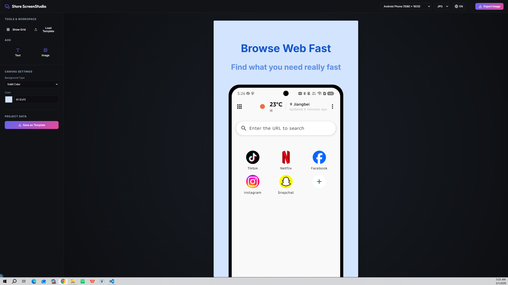

# AppPreviewed

🌍 [*Read this in Chinese / 中文说明*](https://github.com/dhs964057117/AppPreviewed/blob/main/README-zh.md)

**AppPreviewed** is a fast, lightweight, and powerful web application designed to help developers and designers create stunning App Store and Google Play screenshots and mockups with ease. Built with modern web technologies, it offers a seamless editing experience right in your browser.



## ✨ Features

* **Intuitive Canvas Editor**: Easily drag, drop, and edit elements to create your perfect app screenshots.

* **Multiple Platform Support**: Generate device mockups tailored for both Apple App Store and Google Play Store dimensions.

* **Customizable Templates**: Pre-built layouts to get you started quickly.

* **Export to High Quality**: Download your mockups in high-resolution PNG/JPEG formats ready for store submission.

* **SEO & AdSense Ready**: Pre-configured with meta tags, sitemaps, and AdSense integration for easy monetization and discovery.

* **Modern Tech Stack**: Powered by React, Vite, and styled with modern CSS frameworks.

## 🛠️ Local Development

1. Clone the repository:

   ```bash
   git clone [https://github.com/yourusername/AppPreviewed.git](https://github.com/yourusername/AppPreviewed.git)
   cd AppPreviewed
   ```
2. Install dependencies:
   ```bash
   npm install
   ```
3. Start the development server:
   ```bash
   npm run dev
   ```
## 🚀 How to Deploy on Cloudflare Pages

Deploying AppPreviewed to Cloudflare Pages is incredibly simple and highly recommended for global edge performance.

1. Push your code to GitHub: Make sure your AppPreviewed code is pushed to a GitHub repository.

2. Log into Cloudflare: Go to your Cloudflare Dashboard and navigate to Workers & Pages.

3. Create a new Page: Click on Create application -> Pages -> Connect to Git.

4. Select Repository: Authorize your GitHub account and select your AppPreviewed repository.

5. Configure Build Settings:
  * Framework preset: Select Vite
  * Build command: npm run build
  * Build output directory: dist

6. Deploy: Click Save and Deploy. Cloudflare will automatically build and deploy your site, providing you with a live URL!

## 🎁 Also Check Out: SnapSaver

Looking for more awesome tools? Check out my other application currently available on Google Play!

* 🌐 **[SnapSaver Official Website](https://snapsaver.suansuan.dpdns.org/)**
* 📱 **[Get it on Google Play](https://play.google.com/store/apps/details?id=com.awesome.dhs.tools.snapsave)**

---